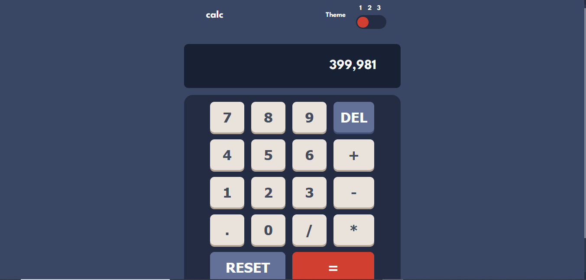

# Frontend Mentor - Calculator app solution

This is a solution to the [Calculator app challenge on Frontend Mentor](https://www.frontendmentor.io/challenges/calculator-app-9lteq5N29). Frontend Mentor challenges help you improve your coding skills by building realistic projects. 

## Table of contents

- [Frontend Mentor - Calculator app solution](#frontend-mentor---calculator-app-solution)
  - [Table of contents](#table-of-contents)
  - [Overview](#overview)
    - [The challenge](#the-challenge)
    - [Screenshot](#screenshot)
    - [Links](#links)
  - [My process](#my-process)
    - [Built with](#built-with)
    - [What I learned](#what-i-learned)
    - [Continued development](#continued-development)
    - [Useful resources](#useful-resources)
  - [Author](#author)

## Overview

### The challenge

Users should be able to:

- See the size of the elements adjust based on their device's screen size
- Perform mathmatical operations like addition, subtraction, multiplication, and division
- Adjust the color theme based on their preference
- **Bonus**: Have their initial theme preference checked using `prefers-color-scheme` and have any additional changes saved in the browser

### Screenshot

Mobile:📱📱


Desktop💻🖥



### Links

- Solution URL: [My solution](https://www.frontendmentor.io/solutions/calculator-app-with-vue-and-sass-odRtLkzEhc)

- Live Site URL: [githubPages](https://purplehippo911.github.io/calculatorApp/)

## My process

### Built with

- Semantic HTML5 markup
- CSS custom properties
- Flexbox
- CSS Grid
- Mobile-first workflow
- [Vue](https://vuejs.org/) - JS framework
- [Sass](https://sass-lang.com/) - For styles

### What I learned

I learned how to use the `eval()`-function to run javascript code in HTML. This is my first challenge using vue, so I got to practice and learn some more about how to use it without the CLI. 

To see how you can add code snippets, see below:


```scss
.calculator__bottom {
    border-radius:20px;
    background:$KeypadBg1;
    .row {
        justify-content: center;
    }
    .grid {
        grid-template-columns: repeat(4, 1fr);
    }
    .calculator__buttons {
        width:90%;
        input {
            border:0;
            border-radius:10px;
            box-shadow: 0px 4px 0px 0px $KeyShadow1;
            background:$KeyBg1;
            color:$KeyText1;
            padding:.5em;
            font-size: 32px;
            font-weight:700;
            cursor:pointer;
            &:hover {
                background:$White1;
            }
        }
    }
```
```js
toggleOpen() {
        this.i++;
        if(this.i == 2 )  {
            document.body.classList.remove(`${this.theme[0]}`);
            this.$refs.slider.style.gridColumnStart = "2";
            document.body.classList.add(`${this.theme[1]}`);
        }
        if(this.i == 4 )  {
            document.body.classList.remove(`${this.theme[1]}`);
            this.$refs.slider.style.gridColumnStart = "3";
            document.body.classList.add(`${this.theme[2]}`);
            
        }
        if(this.i > 5 )  {
            this.i = 0;
            document.body.classList.remove(`${this.theme[2]}`);
            this.$refs.slider.style.gridColumnStart = "1";
            document.body.classList.add(`${this.theme[0]}`);
    
        }
      }
```


### Continued development

I will try to perfect my vue and javascript skills, by continuing to learn about new ways to use them. After that I want to brush up on my basic python skills.

### Useful resources

- [calculator-app tutorial](https://www.youtube.com/watch?v=QS6Y0ezhyCs) - This helped me with the programming part of the calculator. It's a very simple tutorial, which helped me a lot. 
- [W3Schools.com](https://www.w3schools.com) - This is an amazing website which helped me when I forgot how to use a certain piece of code, like how to loop over something and etc. 
- [vuejs.org](https://vuejs.org/guide/essentials/) - This helped me when I was unsure about how to use something in vue.

## Author

- Website - [My website](https://purplehippo911.github.io/website/))
- Frontend Mentor - [@purplehippo911](https://www.frontendmentor.io/profile/purplehippo911)
- CodePen - [@htmlsquid](https://codepen.io/htmlsquid)
